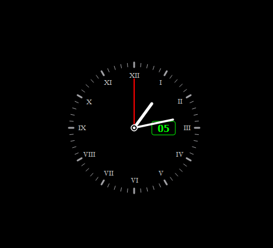

# <center>🕙 Analog Clock </center>
-----
<b> This is a simple analog clock made from PyQt6 in python which can precisely show the times in hour, minute and second along with today's nepali day.



-----
## 🛠️ Installation
Clone the Project
```bash
git clone https://github.com/BrishkamalKarki/analog-clock.git
cd analog-clock
```
Install Dependencies
```bash
pip install PyQt6  
```
Run the Clock
```bash
python main.py
```
-----
## 👤 Author
**Brishkamal Karki A.K.A Karna Raj Karki**

-----


